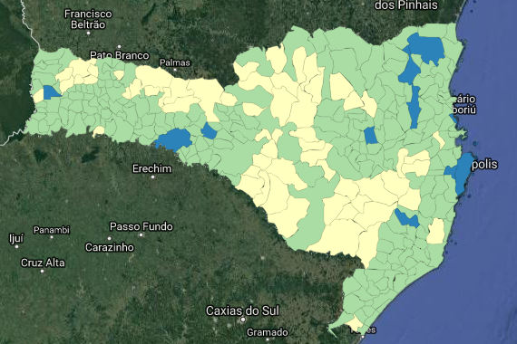

```{r setup, include=FALSE}
knitr::opts_chunk$set(echo = FALSE)

library(robustbase)
library(sandwich)
library(lmtest)
library(mfx)
library(InformationValue) # Probit/logit matriz de informacao
library(stargazer)
library(kableExtra)
library(tidyverse)
```

# Introdução

Este relatório tem por objetivo formular um modelo econômico que relacione a atratividade de investimento público em um município com fatores determinantes deste, como renda per capita, índice de gini, infraestrutura, anos de escolaridade e expectativa de vida, dentre outros. O índice de desenvolvimento humano do município (IDHM) também é estudado e relacionado a fatores explicativos. Municípios com baixo IDHM podem então receber investimentos públicos focados para melhorar estes fatores e trazer um maior desenvolvimento.

Estudos para outros Estados já foram realizados neste sentido, entre eles pode-se citar @Prearo2015 para o estado de São Paulo, que chega a conclusão que investimentos na área de saneamento são especialmente importantes para a determinação do IDHM e @Scarpin2007 com municípios Paranaenses.

Para o estado de Santa Catarina, destaca-se o estudo de @Silva2007 no qual foram analisados variáveis que demonstram vulnerabilidade social e seus impactos na determinação do IDHM. De forma geral, quanto melhor variáveis ligadas a educação e saúde, maior o desenvolvimento humano no município. A figura \@ref(fig:idhsc) apresenta um mapa de SC com o IDHM de seus municíipios em uma graduação de cores que facilita a observação das diferenças de desenvolvimento intermunicipais e a existência de _clusters_ de alto ou subdesenvolvimento. 

(ref:idhsc)  Mapa de desenvolvimento, municípios catarinenses por seus IDHM. Fonte: Atlas do desenvolvimento humano no Brasil. Dados de 2010.

```{r idhsc, fig.cap="(ref:idhsc)"}

```

Após a formulação do modelo, parte-se para o teste econométrico com dados levantados das respectivas fontes. Este estudo busca determinar quais fatores são realmente relavantes para a determinação dos investimentos públicos e IDHM.

# Desenvolvimento

O modelo proposto de explicação do investimento é um modelo do tipo probit, com diversas variáveis explicativas, os regressores, um termo constante e um termo de erro aleatório que representa as variações de na probabilidade de receber investimento que não são captadas pelas variações nos regressores. A equação de regressão a ser estudada é:

\begin{equation}
Prob(investimento|\boldsymbol{X})=G(\boldsymbol{X\beta+\varepsilon})
(\#eq:probit)
\end{equation}

onde a função $G(\boldsymbol{X\beta+\varepsilon})$ é a função densidade acumulada da normal, resultando portanto, em um modelo probit. $\bs{X}$ é a matriz contendo os regressores e o termo constante e $\boldsymbol{\beta}$ é o vetor coluna com os parâmetros a serem estimados.

Para o IDH, o modelo adotado é do tipo logístico. Como o IDH é um índice que varia entre zero e um, este tipo de modelo se mostra mais eficaz ao transformar o domínio da variável para os números reais e permitir uma maior variabilidade desta. A transformação logística é dada pela equação abaixo:

\begin{equation}
y = \ln\left(\frac{idh}{1-idh}\right)
(\#eq:logistica)
\end{equation}

Faremos, portanto, que nossa variável transformada $y$ dependa linearmente de diversos regressores a serem escolhidos no curso deste relatório. A regressão a ser realizada será:

\begin{equation}
\bs{y = X\beta+\varepsilon}
(\#eq:reglog)
\end{equation}

Os dados foram obtidos do professor Fernando Pozzobon que por sua vez fez acesso ao Atlas do Desenvolvimento Humano no Brasil^[Sítio na internet: [http://atlasbrasil.org.br/2013/pt/](http://atlasbrasil.org.br/2013/pt/)]. As  váriáveis presentes na base de dados, suas nomenclaturas e significados estão  apresentadas no apêndice \@ref(apendiceA).

```{r read_data, cache=TRUE}
dados_completos <- read.csv2("dados.csv")
dados <- dados_completos %>% 
  filter(!is.na(investimento))
novos_muni <- dados_completos %>% 
  filter(is.na(investimento)) %>% 
  mutate(ln_rdpc = log(rdpc))
descricao <- read.csv2("descricao.csv", stringsAsFactors = FALSE)
```

## Análise exploratória de dados

As variáveis da base de dados foram categorizadas de acordo com sua afinidade. Esta categorização é importante para não incluirmos nos modelos variáveis com poder de explicação muito semelhante entre si, sem acrescentar informação real. A tabela do apêndice \@ref(apendiceA) apresenta estas categorias juntamente com as variáveis que fazem parte dos grupos.

Dentro de cada grupo, torna-se interessante analisar a correlação entre as variáveis de forma a determinar aquelas mais adequadas a serem utilizadas nos modelos. Abaixo são apresentados paineis de correlação de Pearson para as categorias emprego, população, infraestrutura e saúde.

```{r correlacao}
cor_plot <- function(x) {
  ans <- corrr::correlate(x[, -1]) %>%
    # Re-arrange a correlation data frame 
    # to group highly correlated variables closer together.
    corrr::rearrange(method = "MDS", absolute = FALSE) %>%
    corrr::shave() %>% 
    corrr::rplot(shape = 19, colors = c("red", "green"))
  return(ans)
}

panel_plot <- function(x) {
  ans <- psych::pairs.panels(x[, -1])
  return(ans)
}

dados_long <- dados %>%
  mutate(id = seq_len(nrow(.))) %>% 
  gather(key = "variavel", value = "valor", -id) %>% 
  left_join(descricao, by = "variavel") %>% 
  select(id, variavel, valor, categoria) %>% 
  nest(-categoria) %>% 
  mutate(data = map(data, ~spread(.x, key = variavel, value = valor)))
```

(ref:coremp) Correlação das variáveis de emprego.

(ref:corpop) Correlação das variáveis de população.

(ref:corinf) Correlação das variáveis de infraestrutura.

(ref:corsau) Correlação das variáveis de saúde.

```{r coremp, fig.cap = "(ref:coremp)"}
teste <- dados_long %>% 
  filter(categoria == "emprego") %>%
  select(data) %>% 
  unnest() %>% 
  panel_plot()
```

```{r corpop, fig.cap = "(ref:corpop)"}
teste <- dados_long %>% 
  filter(categoria == "populacao") %>%
  select(data) %>% 
  unnest() %>% 
  panel_plot()
```

```{r corinf, fig.cap = "(ref:corinf)"}
teste <- dados_long %>% 
  filter(categoria == "infraestrutura") %>%
  select(data) %>% 
  unnest() %>% 
  panel_plot()
```

```{r corsau, fig.cap = "(ref:corsau)"}
teste <- dados_long %>% 
  filter(categoria == "saude") %>%
  select(data) %>% 
  unnest() %>% 
  panel_plot()
```

Considerando os resultados desta análise de correlação entre as variáveis dentro de cada categoria, decidiu-se abandonar, por apresentarem correlação perfeita umas com as outras as variáveis "homemtot", "mulhertot", "pia", "pop" e "popt", da categoria população restando apenas as variáveis "pea" e "razdep"; "t_sluz" da categoria infraestrutura, pois esta é perfeitamente e negativamente correlacionada com "t_luz"; e "mort5" na categoria emprego, pois não acrescenta nenhuma informação que já não esteja contida na expectativa de vida.

```{r nomes, results = "asis"}
naoselecionados <- c("homemtot", "mulhertot", "pia", "pop", "popt",
                     "t_sluz", "mort5")
dados_sel <- dados %>% 
  select(-naoselecionados) %>% 
  mutate(investimento = as.factor(investimento))
# nomes <- tibble(variavel = names(dados_sel),
#                 nome = c("Esperança de vida", 
#                          "Anos de estudo com 18 anos", 
#                          "Índice de Gini",
#                          "Renda per capita",
#                          "Percentual domicílios com água e esgoto",
#                          "Investimento"))
```

Passa-se agora a analisar algumas estatísticas descritivas para as variáveis que restaram no modelo, inclusive aquelas que se deseja explicar. 

```{r descritivas, results = "asis"}
# As variaveis indice do painel, id e t, nao aparecem
stargazer(dados_sel,
          header = FALSE,
          title = "Estatísticas descritivas dos dados utilizados.")
```


Na figura \@ref(fig:boxplot) é possível verificar através de _boxplots_ as distribuições das variáveis regressoras quando o município é escolhido para investimento ou não. Estes gráficos oferecem uma informação visual sobre quais variáveis são importantes para modelar o investimento e qual a direção esperada de seu impacto, redução ou elevação de probabilidade de receber investimento.

(ref:boxplot) Boxplots de investimentos para cada variável explicativa.

```{r boxplot, fig.cap="(ref:boxplot)"}
dados_sel_long <- dados_sel %>% 
  mutate(id = seq_len(nrow(.))) %>% 
  gather(key = variavel, value = valor, -c(id, investimento)) 
ggplot(dados_sel_long, aes(x = investimento, y = valor)) +
  geom_boxplot(aes(color = investimento)) +
  guides(color = guide_legend(title = "Inv")) +
  facet_wrap(vars(variavel), scales = "free") +
  theme_classic()
```

Fica bem claro, portanto, que os municípios que recebem investimentos estão em situação de desvantagem em relação aos municípios mais desenvolvidos e que, portanto, não necessitam de recursos públicos. Temos que, por exemplo, municípios com menor anos de estudo, emprego e expectativa de vida ao nascer, necessitam de investimentos. Estes também são os municípios com as maiores taxas de fecundidade, mortalidade e razão de depêndencia. Espera-se que os investimentos atuem na melhoria destas variáveis.

Por outro lado, municípios que já possuem  alta renda per capita, educação e expectativa de vida não necessitam de tantos investimentos e podem aguardar momento mais oportuno para entrar no programa.

## Modelo logístico para IDHM

Partiremos para a análise dos fatores determinantes do IDHM utilizando como base as equações \@ref(eq:logistica) e \@ref(eq:reglog) e como regressores as variáveis selecionadas a partir da análise exploratória dos dados.

Antes mesmo de estimar o modelo, podemos esperar que as variáveis de infraestrutura como "agua_esgoto", de renda per capita, de educação como "e_anosestudo" e de saúde como "mort5" sejam relevantes para determinação do índice, seja por estudos anteriores apontarem neste sentido como pela própria composição do IDHM.

Aplicando a transformação logística da equação \@ref(eq:logistica) ao índice sob análise e computando a regressão múltipla temos os seguintes resultados, na tabela \@ref(tab:logi1).

```{r reglogi1, results='asis'}
logi_sel <- dados_sel %>% 
  mutate(logi_idhm = log(idhm/(1 - idhm)),
         ln_rdpc = log(rdpc))
idx1 <- !(colnames(logi_sel) %in% c("investimento", "idhm", 
                                    "rdpc", "logi_idhm"))
formula1 <- as.formula(paste("logi_idhm", "~",
                            paste(colnames(logi_sel)[idx1], collapse = "+"),
                            sep = ""))
logi1 <- lm(formula1, data = logi_sel)
roblogi1 <- coeftest(logi1, vcov. = vcovHC(logi1))

stargazer(logi1, roblogi1,
          title = "Regressão logística do IDHM. Modelo completo.",
          header = FALSE,
          label = "tab:logi1",
          no.space = TRUE,
          single.row = TRUE,
          dep.var.labels.include = FALSE,
          #dep.var.labels = c("",""),
          dep.var.caption = c(""),
          model.names = FALSE,
          model.numbers = TRUE,
          object.names = FALSE,
          column.labels = c("Logístico", "Logístico Robusto"),
          keep.stat = c("adj.rsq", "f", "ser", "aic"),
          #style = "qje",
          font.size = "normalsize")
```


O modelo oferecido pela regressão robusta da tabela \@ref(tab:logi1) se mostrou com alto poder de explicação, como valor de $R^2$ ajustado de `r format(summary(logi1)$adj.r.squared, digits = 3)`. Mesmo considerando erros padrão robustos, como no modelo (2), não houveram grandes alterações com relação a estimação tradicional feita por MQO. A estatística F do modelo se mostrou significativa a 1\% e portanto, os coeficientes estimados não são todos simultaneamente iguais a zero. Entretanto, diversas variáveis se mostraram pouco significativas, não sendo relevantes nem mesmo a um nível de significância de 10\%. 

Chama a atenção o fato de as variáveis "t_lixo" e "agua_esgoto" não serem significativas. Reestimaremos o modelo retirando todas as variáveis explanatórias que não foram significativas a 10\%. Este novo modelo é apresentado na tabela \@ref(tab:logi2).

```{r reglogi2, results="asis"}
selecionados <- rownames(roblogi1)[roblogi1[,4] <= 0.1]
idx2 <- colnames(logi_sel) %in% selecionados 
formula2 <- as.formula(paste("logi_idhm", "~",
                             paste(colnames(logi_sel)[idx2], collapse = "+"),
                             sep = ""))

logi2 <- lm(formula2, data = logi_sel)
roblogi2 <- coeftest(logi2, vcov. = vcovHC(logi2))

stargazer(logi2, roblogi2,
          title = "Regressão logística do IDHM. Modelo reduzido.",
          header = FALSE,
          label = "tab:logi2",
          no.space = TRUE,
          single.row = TRUE,
          dep.var.labels.include = FALSE,
          #dep.var.labels = c("",""),
          dep.var.caption = c(""),
          model.names = FALSE,
          model.numbers = TRUE,
          object.names = FALSE,
          column.labels = c("Logístico", "Logístico Robusto"),
          keep.stat = c("adj.rsq", "f", "ser", "aic"),
          #style = "qje",
          font.size = "normalsize")
```
 
O modelo apresentado na tabela \@ref(tab:logi2) não perdeu poder de explicação se comparado com o modelo anterior, porém faz uso de um menor número de variáveis explicativas sendo, portanto, preferível aquele. Neste modelo todas as variáveis se mostraram significativas a 5\% ou menos, com excessão de "t_ativ".

Apesar de a interpretação dos sinais dos estimadores seguir a lógica usual, um sinal positivo indica que uma elevação no valor do regressor impacta positivamente o IDHM, devido a transformação logística aplicada no índice, os valores de variação e elasticidade do IDHM com relação as variáveis de interesse não são diretas. É necessário transformar novamente o modelo para se obter as variações, que são apresentadas na tabela \@ref(tab:variacoes).

A partir das equações \@ref(eq:logistica) e \@ref(eq:reglog) é possível demonstrar que:

\begin{equation}
variação=\frac{\partial idh}{\partial x_i}=idh\cdot(1-idh)\cdot\beta_i
(\#eq:variacaolog)
\end{equation}


```{r variacoes, results='asis'}
idhmedio <- mean(logi_sel$idhm)
variacoes <- (coefficients(logi2)*idhmedio*(1 - idhmedio))[-1]
stargazer(variacoes, 
          summary = FALSE,
          header = FALSE,
          title = "Coeficientes de variação no ponto de IDHM médio.",
          label = "tab:variacoes",
          font.size = "scriptsize",
          column.sep.width = "1pt")
```

Nesta tabela a interpretação dos dados é a magnitude da variação no IDHM provocada por uma variação no regressor, apenas deve-se ficar atento a variável de renda per capita, que foi introduzida no modelo em sua forma logarítimica e portanto a interpretração de de variação percentual na renda implicando em variação de pontos no IDHM.

## Modelo probit para investimentos

Com base na amostra de municípios fornecida foi possível estimar um modelo probit para determinar os munícipios que devem receber investimentos públicos ou não. A partir deste modelo, pode-se determinar se um município que está fora da amostra deve receber investimentos ou não. Dadas as características do município, aquelas que foram utilizadas para explicar os níveis de atratividade do investimento, insere-se estas características no modelo e este retornará como resposta a necessidade de provisão de recursos públicos para aquele município. 

Os regressores escolhidos para o modelo probit foram aqueles efetivamente utilizados no modelo logístico para o IDHM. Esta escolha se justifica pela grande correlação negativa encontrada entre este índice e a atratividade para investimentos públicos, já que municípios bem desenvolvidos não possuem uma necessidade tão urgente dos recursos quanto municípios em situação vulnerável.

Primeiramente, o modelo probit ajustado com os dados fornecidos.

```{r probit_model, warning=FALSE}
prob_sel <- logi_sel 
formulaprob <- as.formula(paste("investimento", "~",
                            paste(colnames(prob_sel)[idx2], collapse = "+"),
                            sep = ""))
probit <- glm(formulaprob,
              data = prob_sel,
              family = binomial(link = "probit"))
pprobit <- predict(probit, prob_sel, type = "response")
opt_cut <- optimalCutoff(prob_sel$investimento, pprobit)[1]

selecprob <- rownames(coef(summary(probit)))[coef(summary(probit))[,4] <= 0.1]
idx2 <- colnames(prob_sel) %in% selecprob 
formulaprob2 <- as.formula(paste("investimento", "~",
                                 paste(colnames(prob_sel)[idx2], collapse = "+"),
                                 sep = ""))

probit2 <- glm(formulaprob2,
              data = prob_sel,
              family = binomial(link = "probit"))
pprobit2 <- predict(probit2, prob_sel, type = "response")
opt_cut2 <- optimalCutoff(prob_sel$investimento, pprobit2)[1]
```

```{r modelo_probit, results = "asis"}
stargazer(probit, probit2,
          title = "Modelos probit ajustados.",
          header = FALSE,
          label = "tab:probit",
          no.space = TRUE,
          single.row = TRUE,
          dep.var.labels.include = FALSE,
          #dep.var.labels = c("",""),
          dep.var.caption = c(""),
          model.names = FALSE,
          model.numbers = TRUE,
          object.names = FALSE,
          column.labels = c("Amplo", "Restrito"),
          keep.stat = c("adj.rsq", "f", "ser", "aic", "LL"),
          #style = "qje",
          font.size = "normalsize")
```

## Probit com o pacote `mfx`

```{r mfx, results = "asis", warning=FALSE}
mfx1 <- logitmfx(formulaprob, data = prob_sel, robust = TRUE)
mfx2 <- logitmfx(formulaprob2, data = prob_sel, robust = TRUE)

stargazer(mfx1$mfxest,
          title = "Modelos probit ajustados.",
          header = FALSE,
          label = "tab:mfx",
          no.space = TRUE,
          single.row = TRUE,
          dep.var.labels.include = FALSE,
          #dep.var.labels = c("",""),
          dep.var.caption = c(""),
          model.names = FALSE,
          model.numbers = TRUE,
          object.names = FALSE,
          #column.labels = c("Amplo", "Restrito"),
          #keep.stat = c("adj.rsq", "f", "ser", "aic", "LL"),
          #style = "qje",
          font.size = "normalsize",
          summary = FALSE)
```

Como é possível verificar na tabela \@ref(tab:probit), apenas as variáveis como `r paste(colnames(prob_sel)[idx2], collapse = ", ")`  foram significativas ao nível de 10\% ou menos. Foi portanto, estimado um segundo modelo com a presença apenas destas variáveis, chamado de modelo restrito, que está apresentado ao lado. Mesmo com um número menor de variáveis explicativas, o critério de informação de Akaike informa que o primeiro modelo deve ser o melhor.

Outra forma de avaliar o ajuste destes modelos é através da matriz de porcentagem corretamente prevista. Esta matriz nos fornece um cruzamento entre as respostas previstas pelo modelo ajustado contra a verdadeira resposta na amostra. O resultado do primeiro modelo foi o seguinte.

```{r matriz, results = "asis"}
knitr::kable(
  confusionMatrix(prob_sel$investimento, pprobit, 
                  threshold = opt_cut) / nrow(dados_sel),
  digits = 4,
  caption = "Matriz de porcentagem corretamente prevista do modelo probit.",
  booktabs = TRUE) %>% 
  kable_styling(latex_options = "HOLD_position")
```

Já o resultado para o segundo modelo, sem a presença das variáveis não estatisticamente significativas é apresentado abaixo.

```{r matriz2, results = "asis"}
knitr::kable(
  confusionMatrix(dados_sel$investimento, pprobit2, 
                  threshold = opt_cut2) / nrow(dados_sel),
  digits = 4,
  caption = "Matriz de porcentagem corretamente prevista do modelo probit sem as variáveis não significativas.",
  booktabs = TRUE) %>% 
  kable_styling(latex_options = "HOLD_position")
```

Deseja-se que a diagonal principal da matriz (acerto de previsão) contenha os maiores percentuais possíveis. De acordo com esta matriz para o modelo ajustado este foi exatamente o resultado encontrado para ambos os modelos, evidenciando um bom ajuste. Como tanto a matriz de porcentagem é quanto o critério de informação de Akaike são favoráveis para o modelo amplo, **prossegue-se trabalhando com o modelo mais geral**, contendo todas as variáveis que já haviam sido selecionadas na etapa do modelo logístico.

## Modelo logit para investimentos

Uma alternativa ao modelo probit proposto no item anterior é utilizar um modelo do tipo logit, onde a diferença fundamental reside na função densidade acumulada a ser utilizada. Equanto que o modelo probit utiliza a distribuição normal para calcular as probabilidades, o modelo logit faz uso da chamada distribuição logística, cuja função densidade acumulada é:

\begin{equation}
F(z)=\frac{1}{1+e^{-z}},\quad z\in\mathbb{R}.
(\#eq:distlogistica)
\end{equation}

A implementação deste modelo seguiu exatamente os mesmos passos do probit, incluindo a seleção de variáveis de forma a serem comparáveis os modelos. Os resultados obtidos para a regressão do tipo logit estão apresentados na tabela \@ref(tab:logit).

```{r logit_model, warning=FALSE}
logit <- glm(formulaprob,
              data = prob_sel,
              family = binomial(link = "logit"))
plogit <- predict(logit, prob_sel, type = "response")
opt_cut_log <- optimalCutoff(prob_sel$investimento, plogit)[1]

seleclog <- rownames(coef(summary(logit)))[coef(summary(logit))[,4] <= 0.1]
idxlog2 <- colnames(prob_sel) %in% seleclog
formulalog2 <- as.formula(paste("investimento", "~",
                                 paste(colnames(prob_sel)[idxlog2], collapse = "+"),
                                 sep = ""))

logit2 <- glm(formulalog2,
              data = prob_sel,
              family = binomial(link = "logit"))
plogit2 <- predict(logit2, prob_sel, type = "response")
opt_cut_log2 <- optimalCutoff(prob_sel$investimento, plogit2)[1]
```

```{r modelo_logit, results = "asis"}
stargazer(logit, logit2,
          title = "Modelos logit ajustados.",
          header = FALSE,
          label = "tab:logit",
          no.space = TRUE,
          single.row = TRUE,
          dep.var.labels.include = FALSE,
          #dep.var.labels = c("",""),
          dep.var.caption = c(""),
          model.names = FALSE,
          model.numbers = TRUE,
          object.names = FALSE,
          column.labels = c("Amplo", "Restrito"),
          keep.stat = c("adj.rsq", "f", "ser", "aic", "LL"),
          #style = "qje",
          font.size = "normalsize")
```

Os resultados, como já era esperado, são os mesmos que aqueles apresentados pelo modelo probit na tabela \@ref(tab:probit). Os mesmos regressores são significativos e a direção de seus impactos sobre o investimento são os mesmos. Assim a escolha entre um modelo probit ou logit neste estudo é basicamente de cunho pessoal do gestor público.

# Previsão de atratividade de investimento

Com os dados dos modelos probit e logit é possível fazer uma previsão de resposta com dados fora da amostra, no caso municípios que não integram a base de dados utilizada para fazer o ajuste do modelo. Os dados das variáveis explanatórias destes novos municípios são inseridos no modelo ajustado e o resultado será o valor estimado para a variável binária de interesse. O resultado desta previsão segue na tabela \@ref(tab:previsao)

```{r previsao, results = "asis"}
novos <- paste("Município", 1:4)
prev_prob <- predict(probit, novos_muni, type = "response")
prev_prob <- ifelse(prev_prob >= opt_cut, 1, 0)
prev_log <- predict(logit, novos_muni, type = "response")
prev_log <- ifelse(prev_log >= opt_cut_log, 1, 0)

previsao_tbl <- tibble(municipio = novos,
                       prev_prob = prev_prob,
                       prev_log = prev_log)
knitr::kable(previsao_tbl,
             col.names = c("Município", "Probit", "Logit"),
             caption = "Resultado da previsão dos modelos probit e logit.",
             booktabs = TRUE) %>% 
  kable_styling(latex_options = c("HOLD_position")) %>% 
  add_header_above(c(" " = 1, "Previsão" = 2), bold = TRUE)
```

Apenas o município 2 foi selecionado por ambos os modelos para receber investimentos públicos. Vejamos as características dos municípios para interpretar este resultado. A tabela \@ref(tab:tabmuni) apresenta o valor das variáveis explicativas dos modelos para cada um dos quatro municípios fora da amostra.

```{r tabmuni, results = "asis"}
tibble(Municipio = novos) %>% 
  bind_cols(novos_muni[selecionados[-1]]) %>% 
  mutate(rdpc = exp(ln_rdpc)) %>% 
  select(-ln_rdpc) %>% 
  kable(format = "latex",
        caption = "Caracteristicas dos municipios fora da amostra.",
        booktabs = TRUE) %>% 
  kable_styling(latex_options = "HOLD_position", font_size = 7) %>% 
  row_spec(2, bold = TRUE)
```

É possível verificar que apesar de pequenas variações entre os municípios para as diversas características, o fator determinante para a inclusão do Município 2 no programa de investimentos públicos foi sua **baixa renda per capita**, que está discrepante dos demais.

# Conclusão

Este estudo buscou evidenciar os fatores determinantes do IDHM dos municípios catarinenses. Primeiramente as variáveis da base de dados do atlas de desenvolvimento econômico foram agrupadas em categorias como `r paste(unique(descricao$categoria)[-length(unique(descricao$categoria))], collapse = ", ")`. Variáveis dentro de uma mesma categoria foram selecionadas para o modelo de acordo com suas correlações. Dentre variáveis altamente correlacionadas entre si apenas uma delas foi escolhida para compor o modelo completo de regressão logística para o IDHM.

Neste modelo completo, algumas variáveis não apresentaram poder de explicação e foram retiradas do modelo. Com as variáveis restantes, dentre elas `r paste(selecionados[-1], collapse = ", ")` foi então estimado o modelo reduzido, com poder de explicação tão bom quanto o modelo completo e utilizando um grupo menor de variáveis explicativas.

Para a atratividade de investimentos públicos em um município, foram estimados dois modelos, probit e logit, com resultados semelhantes. Fatores como renda per capita, anos de escolaridade aos 18 anos de idade e expectativa de vida ao nascer e taxa de emprego, contribuem negativamente para esta atratividade. Este resultado é intuitivo, uma vez que estes municípios são aqueles mais desenvolvidos e que possuem maior renda e disponibilidade de recursos privados para tais investimentos, não necessitando dos investimentos públicos.

A regressão do modelo probit mostrou que variáveis presença de água e luz não possuem poder explicativo no modelo, algo pouco intuitivo do ponto de vista econômico, entretanto a presença destas não afetou significativamente a matriz de porcentagem corretamente prevista e foram mantidas para a previsão dos quatro municípios fora da amostra. O modelo logit para efeitos práticos possui equivalência com o modelo probit, as previsões fora da amostra foram feitas para os dois modelos. As demais variáveis que possuem conotação de alto desenvolvimento econômico e social, conforme sugerido pela análise exploratória através de _boxplots_, possuem impacto negativo na atratividade do investimento público (probabilidade de receber este investimento).

Dos quatro municípios analisados para receber investimentos públicos, apenas o Município 2 foi selecionado pelo modelo como atrativo.

\appendix

# Variáveis na Base de Dados {#apendiceA}

```{r descricao, results='asis'}
select(descricao, variavel, nome_curto, categoria) %>% 
  kable(caption = "Variáveis presentes na base de dados.",
        col.names = c("Sigla", "Descrição", "Categoria"),
        booktabs = TRUE)  %>% 
  kable_styling(full_width = FALSE,
                latex_options = "HOLD_position") %>% 
  column_spec(2, width = "12cm")
  
# stargazer(summary = FALSE,
#           header = FALSE,
#           title = "Variáveis presentes na base de dados.",
#           table.placement = "Ht")
```

# Código Fonte

```{r apendice, echo = TRUE, eval = FALSE}
library(robustbase)
library(sandwich)
library(lmtest)
library(InformationValue) # Probit/logit matriz de informacao
library(stargazer)
library(kableExtra)
library(tidyverse)

dados_completos <- read.csv2("dados.csv")
dados <- dados_completos %>% 
  filter(!is.na(investimento))
novos_muni <- dados_completos %>% 
  filter(is.na(investimento)) %>% 
  mutate(ln_rdpc = log(rdpc))
descricao <- read.csv2("descricao.csv", stringsAsFactors = FALSE)

cor_plot <- function(x) {
  ans <- corrr::correlate(x[, -1]) %>%
    # Re-arrange a correlation data frame 
    # to group highly correlated variables closer together.
    corrr::rearrange(method = "MDS", absolute = FALSE) %>%
    corrr::shave() %>% 
    corrr::rplot(shape = 19, colors = c("red", "green"))
  return(ans)
}

panel_plot <- function(x) {
  ans <- psych::pairs.panels(x[, -1])
  return(ans)
}

dados_long <- dados %>%
  mutate(id = seq_len(nrow(.))) %>% 
  gather(key = "variavel", value = "valor", -id) %>% 
  left_join(descricao, by = "variavel") %>% 
  select(id, variavel, valor, categoria) %>% 
  nest(-categoria) %>% 
  mutate(data = map(data, ~spread(.x, key = variavel, value = valor)))

teste <- dados_long %>% 
  filter(categoria == "emprego") %>%
  select(data) %>% 
  unnest() %>% 
  panel_plot()

teste <- dados_long %>% 
  filter(categoria == "populacao") %>%
  select(data) %>% 
  unnest() %>% 
  panel_plot()

teste <- dados_long %>% 
  filter(categoria == "infraestrutura") %>%
  select(data) %>% 
  unnest() %>% 
  panel_plot()

teste <- dados_long %>% 
  filter(categoria == "saude") %>%
  select(data) %>% 
  unnest() %>% 
  panel_plot()

naoselecionados <- c("homemtot", "mulhertot", "pia", "pop", "popt",
                     "t_sluz", "mort5")
dados_sel <- dados %>% 
  select(-naoselecionados) %>% 
  mutate(investimento = as.factor(investimento))

stargazer(dados_sel,
          header = FALSE,
          title = "Estatísticas descritivas dos dados utilizados.")

dados_sel_long <- dados_sel %>% 
  mutate(id = seq_len(nrow(.))) %>% 
  gather(key = variavel, value = valor, -c(id, investimento)) 
ggplot(dados_sel_long, aes(x = investimento, y = valor)) +
  geom_boxplot(aes(color = investimento)) +
  guides(color = guide_legend(title = "Inv")) +
  facet_wrap(vars(variavel), scales = "free") +
  theme_classic()

logi_sel <- dados_sel %>% 
  mutate(logi_idhm = log(idhm/(1 - idhm)),
         ln_rdpc = log(rdpc))
idx1 <- !(colnames(logi_sel) %in% c("investimento", "idhm", 
                                    "rdpc", "logi_idhm"))
formula1 <- as.formula(paste("logi_idhm", "~",
                            paste(colnames(logi_sel)[idx1], collapse = "+"),
                            sep = ""))
logi1 <- lm(formula1, data = logi_sel)
roblogi1 <- coeftest(logi1, vcov. = vcovHC(logi1))

stargazer(logi1, roblogi1,
          title = "Regressão logística do IDHM. Modelo completo.",
          header = FALSE,
          label = "tab:logi1",
          no.space = TRUE,
          single.row = TRUE,
          dep.var.labels.include = FALSE,
          #dep.var.labels = c("",""),
          dep.var.caption = c(""),
          model.names = FALSE,
          model.numbers = TRUE,
          object.names = FALSE,
          column.labels = c("Logístico", "Logístico Robusto"),
          keep.stat = c("adj.rsq", "f", "ser", "aic"),
          #style = "qje",
          font.size = "normalsize")

selecionados <- rownames(roblogi1)[roblogi1[,4] <= 0.1]
idx2 <- colnames(logi_sel) %in% selecionados 
formula2 <- as.formula(paste("logi_idhm", "~",
                             paste(colnames(logi_sel)[idx2], collapse = "+"),
                             sep = ""))

logi2 <- lm(formula2, data = logi_sel)
roblogi2 <- coeftest(logi2, vcov. = vcovHC(logi2))

stargazer(logi2, roblogi2,
          title = "Regressão logística do IDHM. Modelo reduzido.",
          header = FALSE,
          label = "tab:logi2",
          no.space = TRUE,
          single.row = TRUE,
          dep.var.labels.include = FALSE,
          #dep.var.labels = c("",""),
          dep.var.caption = c(""),
          model.names = FALSE,
          model.numbers = TRUE,
          object.names = FALSE,
          column.labels = c("Logístico", "Logístico Robusto"),
          keep.stat = c("adj.rsq", "f", "ser", "aic"),
          #style = "qje",
          font.size = "normalsize")

idhmedio <- mean(logi_sel$idhm)
variacoes <- (coefficients(logi2)*idhmedio*(1 - idhmedio))[-1]
stargazer(variacoes, 
          summary = FALSE,
          header = FALSE,
          title = "Coeficientes de variação no ponto de IDHM médio.",
          label = "tab:variacoes",
          font.size = "scriptsize",
          column.sep.width = "1pt")

prob_sel <- logi_sel 
formulaprob <- as.formula(paste("investimento", "~",
                            paste(colnames(prob_sel)[idx2], collapse = "+"),
                            sep = ""))
probit <- glm(formulaprob,
              data = prob_sel,
              family = binomial(link = "probit"))
pprobit <- predict(probit, prob_sel, type = "response")
opt_cut <- optimalCutoff(prob_sel$investimento, pprobit)[1]

selecprob <- rownames(coef(summary(probit)))[coef(summary(probit))[,4] <= 0.1]
idx2 <- colnames(prob_sel) %in% selecprob 
formulaprob2 <- as.formula(paste("investimento", "~",
                                 paste(colnames(prob_sel)[idx2], collapse = "+"),
                                 sep = ""))

probit2 <- glm(formulaprob2,
              data = prob_sel,
              family = binomial(link = "probit"))
pprobit2 <- predict(probit2, prob_sel, type = "response")
opt_cut2 <- optimalCutoff(prob_sel$investimento, pprobit2)[1]

stargazer(probit, probit2,
          title = "Modelos probit ajustados.",
          header = FALSE,
          label = "tab:probit",
          no.space = TRUE,
          single.row = TRUE,
          dep.var.labels.include = FALSE,
          #dep.var.labels = c("",""),
          dep.var.caption = c(""),
          model.names = FALSE,
          model.numbers = TRUE,
          object.names = FALSE,
          column.labels = c("Amplo", "Restrito"),
          keep.stat = c("adj.rsq", "f", "ser", "aic", "LL"),
          #style = "qje",
          font.size = "normalsize")

knitr::kable(
  confusionMatrix(prob_sel$investimento, pprobit, 
                  threshold = opt_cut) / nrow(dados_sel),
  digits = 4,
  caption = "Matriz de porcentagem corretamente prevista do modelo probit.",
  booktabs = TRUE) %>% 
  kable_styling(latex_options = "HOLD_position")

knitr::kable(
  confusionMatrix(dados_sel$investimento, pprobit2, 
                  threshold = opt_cut2) / nrow(dados_sel),
  digits = 4,
  caption = "Matriz de porcentagem corretamente prevista do modelo probit sem as variáveis não significativas.",
  booktabs = TRUE) %>% 
  kable_styling(latex_options = "HOLD_position")

logit <- glm(formulaprob,
              data = prob_sel,
              family = binomial(link = "logit"))
plogit <- predict(logit, prob_sel, type = "response")
opt_cut_log <- optimalCutoff(prob_sel$investimento, plogit)[1]

seleclog <- rownames(coef(summary(logit)))[coef(summary(logit))[,4] <= 0.1]
idxlog2 <- colnames(prob_sel) %in% seleclog
formulalog2 <- as.formula(paste("investimento", "~",
                                 paste(colnames(prob_sel)[idxlog2], collapse = "+"),
                                 sep = ""))

logit2 <- glm(formulalog2,
              data = prob_sel,
              family = binomial(link = "logit"))
plogit2 <- predict(logit2, prob_sel, type = "response")
opt_cut_log2 <- optimalCutoff(prob_sel$investimento, plogit2)[1]

stargazer(logit, logit2,
          title = "Modelos logit ajustados.",
          header = FALSE,
          label = "tab:logit",
          no.space = TRUE,
          single.row = TRUE,
          dep.var.labels.include = FALSE,
          #dep.var.labels = c("",""),
          dep.var.caption = c(""),
          model.names = FALSE,
          model.numbers = TRUE,
          object.names = FALSE,
          column.labels = c("Amplo", "Restrito"),
          keep.stat = c("adj.rsq", "f", "ser", "aic", "LL"),
          #style = "qje",
          font.size = "normalsize")

novos <- paste("Município", 1:4)
prev_prob <- predict(probit, novos_muni, type = "response")
prev_prob <- ifelse(prev_prob >= opt_cut, 1, 0)
prev_log <- predict(logit, novos_muni, type = "response")
prev_log <- ifelse(prev_log >= opt_cut_log, 1, 0)

previsao_tbl <- tibble(municipio = novos,
                       prev_prob = prev_prob,
                       prev_log = prev_log)
knitr::kable(previsao_tbl,
             col.names = c("Município", "Probit", "Logit"),
             caption = "Resultado da previsão dos modelos probit e logit.",
             booktabs = TRUE) %>% 
  kable_styling(latex_options = c("HOLD_position")) %>% 
  add_header_above(c(" " = 1, "Previsão" = 2), bold = TRUE)

tibble(Municipio = novos) %>% 
  bind_cols(novos_muni[selecionados[-1]]) %>% 
  mutate(rdpc = exp(ln_rdpc)) %>% 
  select(-ln_rdpc) %>% 
  kable(format = "latex",
        caption = "Caracteristicas dos municipios fora da amostra.",
        booktabs = TRUE) %>% 
  kable_styling(latex_options = "HOLD_position", font_size = 7) %>% 
  row_spec(2, bold = TRUE)

select(descricao, variavel, nome_curto, categoria) %>% 
  kable(caption = "Variáveis presentes na base de dados.",
        col.names = c("Sigla", "Descrição", "Categoria"),
        booktabs = TRUE)  %>% 
  kable_styling(full_width = FALSE,
                latex_options = "HOLD_position") %>% 
  column_spec(2, width = "12cm")
```

# Referêcias {-}